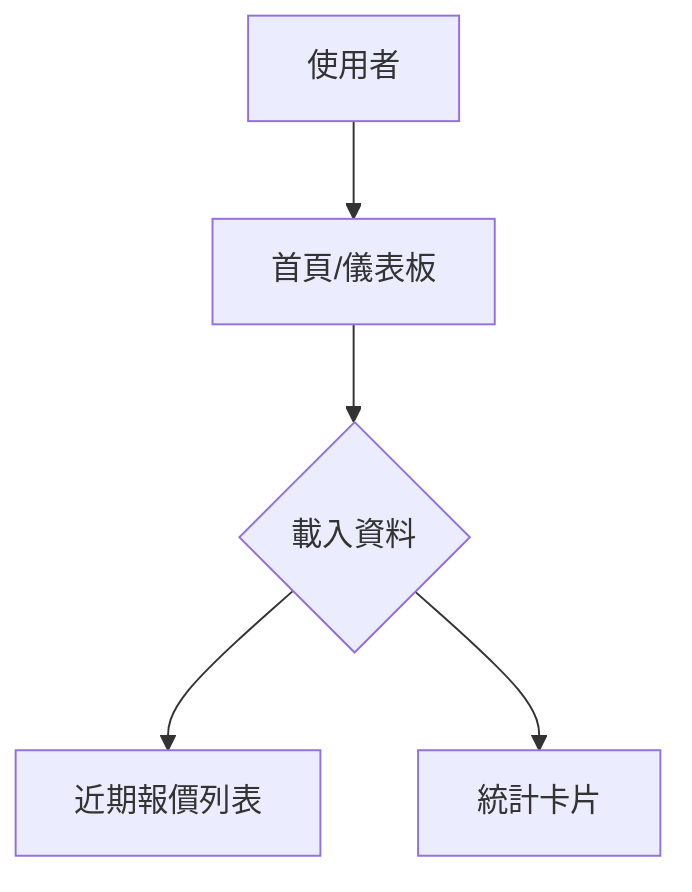

# 01-dashboard.md

## 功能概述
- 用途說明：提供系統概覽，展示關鍵指標（KPI）、近期報價活動。
- 使用者角色：業務人員、管理員

## 相關檔案
| 類型 | 檔案路徑 |
|------|---------|
| 前端頁面 | `src/app/page.tsx` |
| 前端元件 | `src/components/dashboard/DashboardPanel.tsx` |

## 技術架構

### 資料流程圖

### API 端點
| 方法 | 路徑 | 說明 |
|------|------|------|
| GET | `/api/sheets/init` | 初始化並獲取基礎數據 |

## 功能細節
- 儀表板目前整合了系統入口，展示快速操作選項。
- 提供直觀的數據卡片（開發中）。

## 核心程式碼
- `DashboardPanel`: 處理儀表板佈局與顯示。

## 相依模組
- `08-pos-quotation.md` (獲取報價數據)

## 待優化項目
- [ ] 實作動態圖表分析。
- [ ] 增加待辦事項通知。
