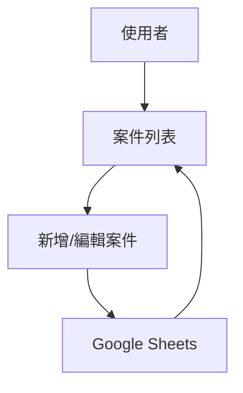

# 02-order-management.md

## 功能概述
- 用途說明：管理客戶案件（Cases），追蹤案件狀態與關聯報價。
- 使用者角色：業務人員

## 相關檔案
| 類型 | 檔案路徑 |
|------|---------|
| 前端頁面 | `src/app/cases/page.tsx` |
| 前端元件 | `src/app/cases/CasesClient.tsx` |
| API | `src/app/api/sheets/cases/route.ts` |

## 技術架構

### 資料流程圖

### API 端點
| 方法 | 路徑 | 說明 |
|------|------|------|
| GET | `/api/sheets/cases` | 獲取案件列表 |
| POST | `/api/sheets/cases` | 建立新案件 |
| PATCH | `/api/sheets/cases/[caseId]` | 更新案件資訊 |

## 功能細節
- 案件生命週期管理：從建立到結案。
- 案件與客戶 (Clients) 關聯。
- 查看案件下的所有報價版本。

## 核心程式碼
- `useQuote`: 處理案件與報價的邏輯 Hook。

## 相依模組
- `08-pos-quotation.md`

## 待優化項目
- [ ] 增加案件進度百分比顯示。
