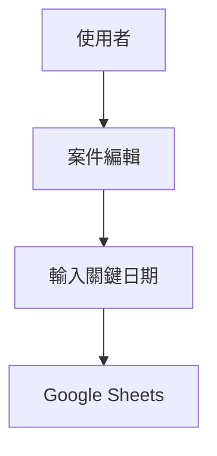

# 03-date-scheduling.md

## 功能概述
- 用途說明：追蹤案件的關鍵日期，如預計交期、施工日期。
- 使用者角色：業務人員、施工團隊

## 相關檔案
| 類型 | 檔案路徑 |
|------|---------|
| 前端元件 | `src/app/cases/CasesClient.tsx` |
| 資料結構 | `src/lib/types.ts` (Case 介面) |

## 技術架構

### 資料流程圖

## 功能細節
- 目前整合於案件管理中，支援記錄案件的建立日期與更新日期。
- 未來規劃獨立的行事曆檢視。

## 相依模組
- `02-order-management.md`
