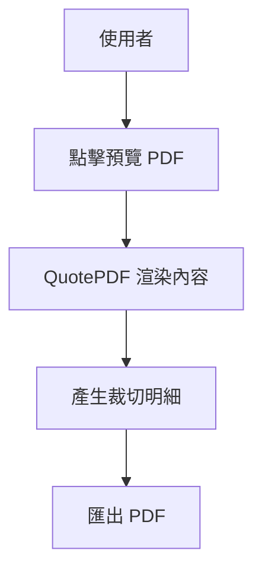

# 04-work-orders.md

## 功能概述
- 用途說明：產生施工用的裁切表與正式 PDF 報價單。
- 使用者角色：業務人員、工廠師傅

## 相關檔案
| 類型 | 檔案路徑 |
|------|---------|
| 前端元件 | `src/components/pdf/QuotePDF.tsx` |
| 前端元件 | `src/components/pdf/PDFPreviewModal.tsx` |
| API | `src/app/api/pdf/route.ts` |

## 技術架構

### 資料流程圖

## 功能細節
- **PDF 報價單**：包含公司 Logo、印章、條款及品項明細。
- **裁切表**：自動根據計算器結果產出面料與泡棉的裁切尺寸。

## 核心程式碼
- `QuotePDF`: 使用 `@react-pdf/renderer` 進行 PDF 佈局。

## 相依模組
- `08-pos-quotation.md`
