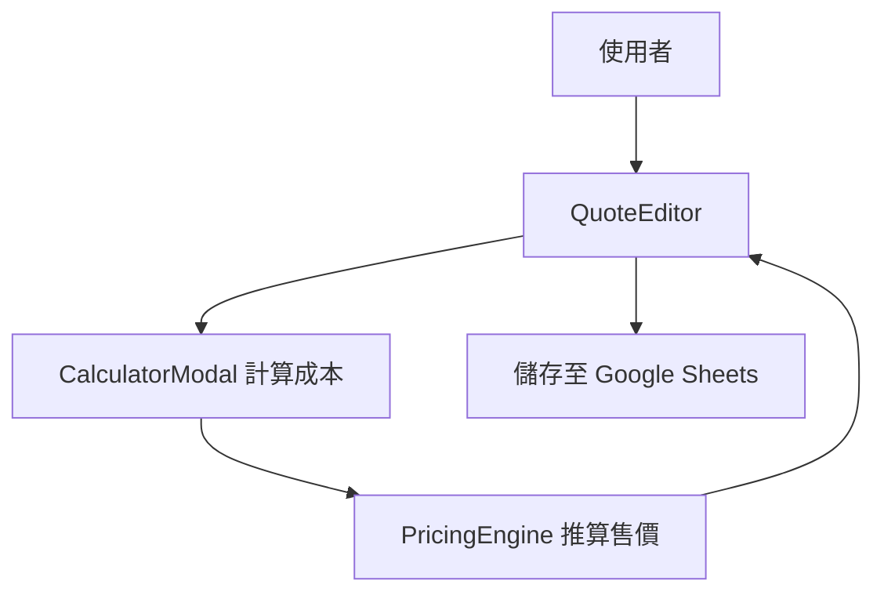

# 08-pos-quotation.md

## 功能概述
- 用途說明：核心報價系統，包含彈性品項編輯、成本計算、佣金計算。
- 使用者角色：業務人員

## 相關檔案
| 類型 | 檔案路徑 |
|------|---------|
| 前端頁面 | `src/app/quotes/page.tsx` |
| 前端元件 | `src/components/quote-editor/QuoteEditor.tsx` |
| 前端元件 | `src/components/quote-editor/CalculatorModal.tsx` |
| 邏輯層 | `src/lib/pricing-engine.ts` |

## 技術架構

### 資料流程圖

### API 端點
| 方法 | 路徑 | 說明 |
|------|------|------|
| POST | `/api/sheets/quotes-v2` | 儲存 V2 版報價 |
| GET | `/api/sheets/versions` | 獲取報價版本紀錄 |

## 功能細節
- **彈性品項**：支援自定義品項名稱、規格、數量、單價。
- **自動定價**：根據成本與通路倍率自動產出建議售價。
- **佣金模式**：支援「賺價差」、「返佣」、「固定金額」等多種模式。
- **稅務處理**：支援含稅/未稅切換。

## 核心程式碼
- `recalculateAutoPricedItems`: 處理自動定價的核心邏輯。
- `isAutoPricedItem`: 判斷品項是否應受通路/佣金連動。

## 相依模組
- `05-material-analysis.md` (面料數據)
- `09-system-settings.md` (通路倍率)

## 待優化項目
- [ ] 報價單快照功能（永久保留圖片路徑）。
